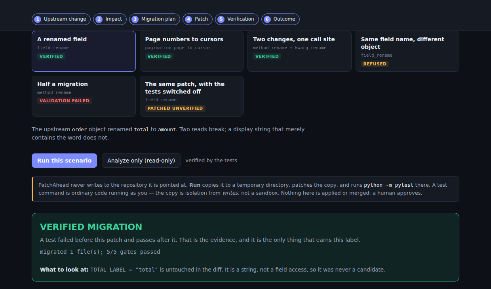
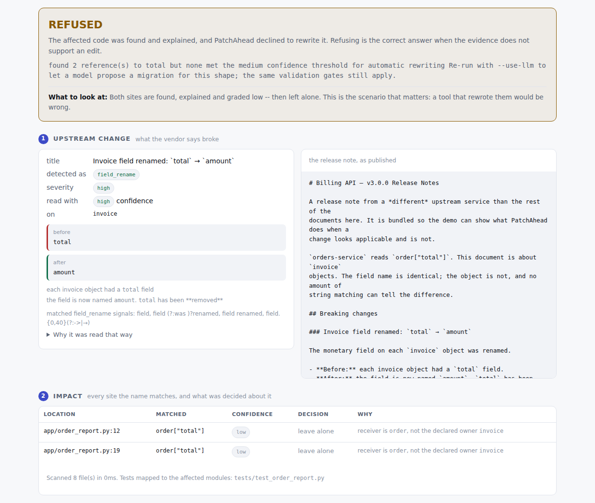
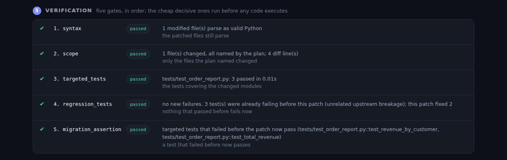

# PatchAhead

**An upstream API changes. Which of your code breaks, what is the smallest
correct fix, and can it be proven to work?**

PatchAhead reads a release note, finds the affected call sites with AST
analysis, patches a throwaway copy of your repository, and runs your tests
against it. A migration counts as done only when a test that failed *before* the
patch passes *after* it — and when the evidence is not there, it says so instead
of claiming success.

```text
release note → classify → AST impact → plan → minimal patch → 5 gates → verdict
```

## See it work

```bash
git clone https://github.com/FrimpsManu/patchahead
cd patchahead
pip install -e '.[demo]'
patchahead demo
```

> PatchAhead is **not published to PyPI yet** — there is no release and no
> publishing workflow — so a source install is the real path. `pip install
> 'patchahead[demo]'` is what this becomes after the first release, and the
> package builds and installs as a wheel today (CI checks exactly that); it is
> simply not on an index for `pip` to find.

That serves a local page at `http://127.0.0.1:8000` with six bundled scenarios
against a deliberately-broken example service. No repository of your own to find,
nothing to configure, and no demo-only code path: every scenario calls the same
`patchahead.engine` the CLI does, copies the bundled repository to a temporary
directory, patches the copy, and runs its tests there.

<!-- DEMO RECORDING GOES HERE.
     docs/demo-recording.md has an exact 45-second sequence to capture.
     Save the result as docs/media/demo.gif and replace this comment with:
         
     The stills below are real captures of the same UI and can stay. -->



Three of the scenarios end in a verified migration. Three do not, on purpose —
because the interesting claim is not "it rewrites code", it is that it knows
when not to:



That release note is about `invoice` objects; the repository only has `order`
objects. The field name is identical, so a text-matching tool rewrites both
sites. PatchAhead finds them, explains them, grades them low, and leaves them
alone.

## Proof, not adjectives

| | |
|---|---|
| **0 false-positive patches** | across the 37 site-detection cases (`impact` + `adversarial`), covering 38 scored patch sites: 38 found, 0 wrong, precision and recall 1.0. The other 37 cases measure classification, end-to-end migration, and the validation gates themselves — 70 of 74 pass, and the 4 that do not are recorded gaps, listed in [docs/evaluation.md](docs/evaluation.md#the-gaps-that-remain). The 29 adversarial cases are written to fool it: unrelated objects sharing a field name, strings that merely contain it, Unicode before an edit site, nested scopes, comprehensions, already-migrated code. Recomputed on every CI run. |
| **4 recorded gaps, none of them a wrong edit** | Each is a case stating what a *correct* tool does, run and scored on every build. All four are aliasing — `for o in orders`, `current = order`, `self._order`, `factory.get_client()` — and in all four PatchAhead finds the site and declines to rewrite it. A gap may only under-patch: a marked case that produces a wrong edit fails the build anyway, and a marked case that starts passing fails it too. |
| **433 automated tests** | covering unit, integration, and end-to-end behavior. Deterministic migrations, filesystem workspaces, subprocess test execution, packaging, and clean-wheel installs are exercised for real; the Anthropic API is mocked because it is remote, paid, and non-deterministic. |
| **Five gates decide, nothing else** | `syntax → scope → targeted_tests → regression_tests → migration_assertion`. `MigrationResult.succeeded` is defined as "the assertion gate passed", and that gate passes only on red-to-green evidence — a green-to-green run, a suite still red, or a test runner that never started all report `patched_unverified`, not success. |
| **No runtime dependencies** | on Python 3.11+. The core is `argparse` and `ast`. A migration tool a team has to vet three transitive dependencies for is one they will not install. |



## Supported migrations

`field_rename` · `method_rename` · `kwarg_rename` · `pagination_page_to_cursor`

Four families, each with parsing, analysis, planning, patching, validation,
tests and documentation — that is the bar for inclusion. Anything else is
reported as **unsupported** rather than forced into a family that happens to
fit. `patchahead handlers` prints what each one explicitly does *not* do, and
[docs/migrations.md](docs/migrations.md) has the confidence tables.

## Safety, stated plainly

PatchAhead never writes to your repository: `Repository` has no `write` method,
so there is no call to make by mistake. But **the workspace copy is not a
sandbox** — `migrate` runs your repository's configured test command with
`shell=True`, as you, with your environment and your network. Running it on a
repository you do not trust is the same decision as running `pytest` in one.

[docs/safety.md](docs/safety.md) separates the three things that are easy to
conflate: where PatchAhead writes, what the workspace isolates (filesystem
writes in the copy, and nothing else), and what a test command can do.

## What the CLI prints

```console
$ patchahead migrate --repo ./my-service --change ./release-notes.md

Pagination is now cursor-based
  kind        pagination_page_to_cursor
  severity    high    confidence high

  1 finding(s) in 1 file(s), scanned 5 file(s) in 4ms
  + app/order_sync.py:12  high  sync_all_orders  while True: ... page=page ...

proposed diff
  @@ -9,16 +9,16 @@
   def sync_all_orders(api_client):
  -    page = 1
  +    cursor = None
       all_orders = []
       while True:
  -        response = api_client.get_orders(page=page)
  +        response = api_client.get_orders(cursor=cursor)
           all_orders.extend(response["orders"])
  -        if page >= response["total_pages"]:
  +        if not response.get("has_more"):
               break
  -        page += 1
  +        cursor = response.get("next_cursor")

validation
  [pass] syntax               1 modified file(s) parse as valid Python
  [pass] scope                1 file(s) changed, all named by the plan; 8 diff line(s)
  [pass] targeted_tests       tests/test_order_sync.py: 1 passed
  [pass] regression_tests     no new failures
  [pass] migration_assertion  tests that failed before the patch now pass

migrated: migrated 1 file(s); 5/5 gates passed
```

Your repository was never written to. That diff was produced in a temporary
copy, and the tests that verified it ran there.

---

## The idea

> Static evidence identifies risk. AI can propose. Tests verify. Humans approve.

Each of those is a separate stage with a separate output, and each stage can say
"I don't know":

| Stage | Produces | Can refuse |
|---|---|---|
| Ingest a change document | `BreakingChange` with graded confidence | yes — `unknown` / `unsupported` |
| Analyze the repository (AST) | `ImpactReport` with per-site confidence | yes — reports a site without patching it |
| Plan the migration | `MigrationPlan` you can read before anything changes | yes — `blocked_reason` |
| Generate a patch | `PatchProposal` + unified diff | yes — structured error |
| Validate | `ValidationResult`, five gates | it is the thing that refuses |

`MigrationResult.succeeded` is defined as "validation verified it". Nothing else
in the codebase is allowed to decide that a migration worked.

## What it is not

- **Not a general code-repair tool.** It performs four documented migration
  families (`patchahead handlers`). Everything else is reported as unsupported.
- **Not a sandbox.** It runs your repository's test command with your
  privileges. See [docs/safety.md](docs/safety.md).
- **Not a changelog monitor.** You give it a file. It does not watch registries,
  poll feeds, or open pull requests.
- **Not an autonomous agent.** It proposes; it never applies, commits, or merges.

## Install

From a clone, which is the only path until there is a release:

```bash
pip install -e .                 # core tool: no third-party runtime deps on 3.11+
pip install -e '.[demo]'         # + the local UI and the bundled walkthrough
pip install -e '.[llm]'          # + LLM proposals when a shape is unrecognized
pip install -e '.[all]'          # everything
patchahead --help
```

Python 3.10+.

| Extra | Brings | For |
|---|---|---|
| `web` | FastAPI, uvicorn | `patchahead web` against your own repository |
| `demo` | `web` + pytest | `patchahead demo` — the bundled repository's tests have to actually run, or nothing can be *verified* |
| `llm` | `anthropic` | the constrained fallback, off by default |
| `yaml` | PyYAML | YAML change documents; JSON needs nothing |
| `sentry` | `sentry-sdk` | optional error reporting |

The same names work as `pip install 'patchahead[demo]'` once the project is
published; it is not on PyPI today, so `pip` cannot resolve that yet.

## Your first migration

`patchahead demo` is the shortest route, but everything it does is available
from the command line. The bundled example service ships inside the package;
`--print-paths` says where it landed in your installation:

```bash
repo=$(patchahead demo --print-paths | awk '/^repository/ {print $2}')
changes=$(patchahead demo --print-paths | awk '/^changes/ {print $2}')

# 1. What does this change break?
patchahead analyze --repo "$repo" --change "$changes/pagination-cursor.md"

# 2. What would you do about it? (nothing is changed)
patchahead migrate --repo "$repo" --change "$changes/pagination-cursor.md" --dry-run

# 3. Do it, in a temporary copy, and prove it with the tests.
patchahead migrate --repo "$repo" --change "$changes/pagination-cursor.md"
```

`patchahead demo --list` describes every bundled scenario, including the ones
that are supposed to fail.

Then point it at your own repository. Release notes in Markdown work; so does a
structured JSON/YAML description if the prose is too vague
(see [docs/migrations.md](docs/migrations.md#structured-change-documents)).

## Supported change types

```console
$ patchahead handlers
```

| Family | Example | Notes |
|---|---|---|
| `field_rename` | `order["total"]` → `order["amount"]` | subscripts, `.get()`, attributes |
| `method_rename` | `client.fetch_orders()` → `client.list_orders()` | call sites only |
| `kwarg_rename` | `fetch(timeout_seconds=5)` → `fetch(timeout=5)` | explicit keyword arguments only |
| `pagination_page_to_cursor` | `page`/`total_pages` → `cursor`/`has_more` | one documented loop shape |

Each has parser support, AST impact analysis, planning, patch generation,
validation, tests, and documentation — that is the bar for inclusion, and
[docs/migrations.md](docs/migrations.md) states exactly what each one refuses to
do. v1 supports four families deliberately; breadth without correctness is
worse than nothing here.

## Safety model

1. **Your tree is never written to.** `Repository` has no `write` method.
   Patching happens in a `Workspace` — a temporary copy. That copy confines
   *PatchAhead's own writes*; it is not a sandbox, and your test command still
   runs with your privileges. [docs/safety.md](docs/safety.md) separates the
   three.
2. **Minimal edits.** Patches replace AST-derived source *ranges*, not whole
   files, so comments, formatting, and blank lines survive and diffs stay small.
3. **Fail closed.** A code shape a handler does not recognize produces a stated
   refusal, never a guess.
4. **Five gates.** syntax → scope → targeted tests → regression → migration
   assertion. `migrated` requires a test that *failed before the patch and
   passes after it*; a green-to-green run is reported `patched_unverified`.
5. **No auto-merge.** Ever. The output is a diff and a review checklist.

Full threat model, including what PatchAhead does *not* protect you from:
[docs/safety.md](docs/safety.md).

## LLM mode

Off by default. `--use-llm` is used in exactly one situation: a deterministic
handler found real impact but **refused to plan** because the code shape was
unfamiliar. A mechanical AST rename does not need a model.

What the model gets: the breaking change, the failing test output, and **only
the functions the impact findings point at**. Not the file, never the repository.

What happens to its answer: rejected — not repaired — if it is not valid JSON,
names a file the impact report does not implicate, does not parse as Python,
renames a function, or changes a signature. Whatever survives goes through the
same five gates as a deterministic patch.

```bash
export ANTHROPIC_API_KEY=...
patchahead migrate --repo ./my-service --change ./notes.md --use-llm
```

A repository can forbid this outright with `allow_llm = false`; `--use-llm`
cannot override it.

## Configuration

Optional. Sensible defaults work with no configuration at all. Put this in your
`pyproject.toml`, or in a `.patchahead.toml`:

```toml
[tool.patchahead]
test_command = "python -m pytest"   # what verifies a migration
source_dirs = ["src"]               # where to look (tests are still found repo-wide)
exclude = ["vendor"]                # added to the built-in exclusions
max_changed_files = 10              # scope gate limit
max_diff_lines = 400                # scope gate limit
min_confidence = "medium"           # findings below this are reported, not patched
allow_llm = true                    # false forbids `--use-llm` for this repository
output_dir = ".patchahead"          # where the diff, plan, and result are written
```

An unknown key is an error, not a silent no-op.

## Exit codes

| Code | Meaning |
|---|---|
| 0 | Succeeded (analysis ran; migration verified; dry run completed) |
| 1 | Impact found but not migrated — validation failed, or no plan was possible |
| 2 | Usage error — bad arguments, missing file, unreadable config |
| 3 | The change is real but unsupported by this version |

## Architecture

```
change document ─▶ ingest ─────▶ BreakingChange   (kind, target, confidence, evidence)
                                       │
repository ──────▶ AST index ──▶ ImpactReport     (site, symbol, confidence, reason)
                                       │
                              handler.plan ─────▶ MigrationPlan  (inspectable; --dry-run stops here)
                                       │
                    isolated workspace ─▶ PatchProposal (range edits → unified diff)
                                       │
                          validation ──▶ ValidationResult (5 gates)
                                       │
                                MigrationResult ─▶ diff + PR summary  (a human approves)
```

The CLI, the web UI, and the tests all call `patchahead.engine`. There is no
second code path for demos. [docs/architecture.md](docs/architecture.md).

## Web UI (optional)

```bash
pip install -e '.[demo]'                                 # bundled walkthrough
patchahead demo

pip install -e '.[web]'                                  # your own repository
patchahead web --repo ./my-service --changes ./changes
```

`[demo]` is `[web]` plus pytest: the walkthrough migrates a real repository and
runs its tests, and without a runner nothing it shows can be verified. `[web]`
alone is enough to point the UI at a repository that brings its own.

The same page in both cases — upstream change, impact, plan, diff, the five
gates, and the pull-request summary — and the same engine underneath. The demo
adds only a list of scenarios, each of which chooses a change document and
whether tests run; both are ordinary engine inputs. Binds to `127.0.0.1` only,
and it runs your test command.

## Development

```bash
pip install -e '.[dev]'
python -m pytest            # the test suite
python -m pytest -m "not slow"   # skip tests that spawn a real pytest
python evals/run.py         # the evaluation benchmark
ruff check src tests evals
```

The benchmark has five suites — classification, impact, adversarial, migrations
and validation — and reports precision, recall, F1, confidence calibration, a
five-way migration outcome taxonomy, patch size, and per-gate verdicts. Cases
PatchAhead is expected to *fail* are in the datasets on purpose, marked with a
reason; a marked case that starts passing fails the build, because a stale
marker is a benchmark lying in the other direction.
[docs/evaluation.md](docs/evaluation.md) explains the suites and how to add a
case.

To record the demo: [docs/demo-recording.md](docs/demo-recording.md).

[docs/contributing.md](docs/contributing.md) walks through adding a migration
family — the main way to extend PatchAhead without touching the core engine.

## Limitations

Stated plainly, because a migration tool that overstates its reach is worse than
no tool:

- **Python only.** No TypeScript, Go, or anything else.
- **No type inference.** Impact analysis matches *names*. When a change document
  asserts an owner, only that receiver is patched — so `customer["total"]`
  survives an `order.total` rename, and so does `o["total"]` in
  `for o in orders`, because `o` cannot be shown to be an `order`. That is a
  deliberate false negative: unrecoverable wrong edits are worse than
  recoverable missed ones.
- **No dataflow.** `t = order["total"]` is renamed; a later use of `t` is not
  traced.
- **One pagination loop shape.** Documented in `docs/migrations.md`. Anything
  else is refused.
- **Test discovery is name-based.** `app/client.py` → `tests/test_client.py`.
  It does not trace imports, which is why the regression gate always runs the
  full suite too.
- **Release-note parsing is heuristic.** Measured, not assumed:
  `python evals/run.py` reports current accuracy. Structured JSON/YAML input
  exists for when prose is not good enough.
- **Single repository, local only.** No monorepo-aware cross-package analysis,
  no GitHub integration.

## Roadmap

Not implemented. Listed so the scope above stays unambiguous:

- OpenAPI / spec-diff ingestion
- SDK release monitoring
- A GitHub App that opens the migration PR
- TypeScript support
- More migration families (response-shape changes, endpoint moves)
- Dependency-graph-aware impact analysis
- Richer test selection (import-graph based)
- CI-native mode

## License

MIT. See [LICENSE](LICENSE).
