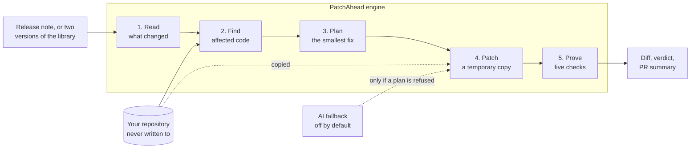
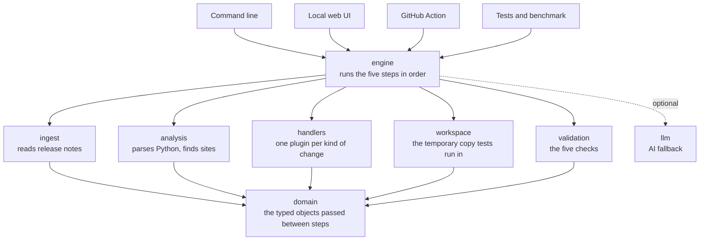

# PatchAhead

**When an API you depend on changes, PatchAhead updates your Python code to
match, and proves the fix works with your own tests.**

You give it the release note. It finds the code that breaks, writes the
smallest fix in a temporary copy of your project, and runs your tests. It only
calls a fix done when a test that failed before the fix passes after it. When it
is not sure, it says so and leaves your code alone.

```text
release note  ->  find affected code  ->  plan  ->  patch a copy  ->  run your tests  ->  verdict
```

## Why this exists

Almost every app talks to services it does not control: payments, email,
storage, AI models. Those services change. A field gets renamed, a method gets
a new name, pagination switches from page numbers to cursors. Your code did not
change, but it is now broken.

Keeping up is slow and risky by hand. Someone has to read the release note,
search the codebase, fix every spot without touching unrelated code that
happens to use the same name, and test it all. Teams put it off, and old
versions pile up.

PatchAhead automates that work, and it is deliberately careful about it. A
migration tool that makes a wrong edit is worse than no tool, so every step can
refuse, and nothing is called a success without evidence from your tests.

## See it in 30 seconds

```bash
pip install 'patchahead[demo]'
patchahead demo
```

This opens a local page with six example scenarios against a small, deliberately
broken service. Three end in a verified fix. The other three show it refusing,
being rejected by the tests, and reporting a patch it could not prove.


Python 3.10 or newer. `pip install patchahead` alone is the core tool, with no
third-party dependencies on 3.11+; [docs/usage.md](docs/usage.md#install) lists
the extras.

## What it looks like

Given a release note that says the `page` parameter was replaced by `cursor`:

```console
$ patchahead migrate --repo ./my-service --change ./release-notes.md

Pagination is now cursor-based
  1 finding(s) in 1 file(s), scanned 8 file(s) in 0ms
  + app/order_sync.py:12  high  sync_all_orders  while True: ... page=page ...

proposed diff
  -    page = 1
  +    cursor = None
  -        response = api_client.get_orders(page=page)
  +        response = api_client.get_orders(cursor=cursor)
  -        if page >= response["total_pages"]:
  +        if not response.get("has_more"):
  -        page += 1
  +        cursor = response.get("next_cursor")

validation
  [pass] syntax               1 modified file(s) parse as valid Python
  [pass] scope                1 file(s) changed, all named by the plan; 8 diff line(s)
  [pass] targeted_tests       tests/test_order_sync.py: 1 passed
  [pass] regression_tests     no new failures
  [pass] migration_assertion  the targeted tests failed before the patch and pass after it

completeness
  `page` -> `cursor`: no code, dynamic access, or test still uses `page`

migrated: migrated 1 file(s); 5/5 gates passed
```

Your repository was not touched. The diff was made in a temporary copy, and the
tests ran there. You review it and apply it.

The last section matters as much as the tests. Passing tests show that the code
they run works; they do not show the migration is *finished*. So after
patching, PatchAhead searches the patched copy for every place the old name
still appears and sorts them: code it did not rewrite (a bare reference, a
`getattr(obj, "old_name")`), tests that still use the old name, sites on a
different object left alone on purpose, and mere mentions in strings, comments,
config, and docs. `--require-complete` makes CI fail while any code or test
still uses the old name.

## What it can fix

| Change | Example |
|---|---|
| A renamed field | `order["total"]` becomes `order["amount"]` |
| A renamed method | `client.fetch_orders()` becomes `client.list_orders()` |
| A renamed keyword argument | `fetch(timeout_seconds=5)` becomes `fetch(timeout=5)` |
| Page numbers to cursors | a `page` / `total_pages` loop becomes `cursor` / `has_more` |

It reads release notes the way vendors write them: headings, bullet lists,
tables, reStructuredText and Sphinx (CPython's own "What's New"), and phrasings like "renamed to", "is now", or
"deprecated in favor of". Anything outside these four kinds of change is
reported as unsupported, not forced into one that almost fits.

## No release note? Compare the versions

Many libraries describe breaking changes badly, or not at all. PatchAhead can
read them out of the library itself, by comparing the version you use with the
one you are upgrading to:

```console
$ patchahead api-diff pydantic 1.10.13 2.0 --out changes.json
pydantic 1.10.13 -> 2.0: compared 459 public member(s)
  ...
  method_rename   `pydantic.main.BaseModel.dict` renamed to `model_dump`
  method_rename   `pydantic.main.BaseModel.parse_obj` renamed to `model_validate`
  reported        `pydantic.main.BaseModel.json` is deprecated in favor of `model_dump_json`
                  `BaseModel.json` is newly deprecated in favor of `BaseModel.model_dump_json`,
                  which does not accept every call it does -- not a rename PatchAhead can apply
  ...

$ patchahead migrate --repo ./my-service --change changes.json
```

It downloads both versions from PyPI as wheels and parses them. Nothing is
installed or run. A method counts as renamed only when the old one is gone or
deprecated **and** the new one accepts every call the old one did. A
replacement that takes different arguments is reported, never applied.

## Use it in CI

PatchAhead ships as a GitHub Action. Put it on the pull requests Dependabot or
Renovate open, and every dependency bump gets checked:

```yaml
on: pull_request
permissions:
  contents: read
  pull-requests: write          # for the comment; Dependabot's token is read-only otherwise
jobs:
  patchahead:
    if: github.actor == 'dependabot[bot]'
    runs-on: ubuntu-latest
    steps:
      - uses: actions/checkout@v4
      - uses: FrimpsManu/patchahead@v0.4.0
        with:
          from-pull-request: true
          install-command: pip install -r requirements-dev.txt
          comment: true
```

It reads the release notes in the pull request **and** compares the two
versions of each package it bumps. The two check each other: a release note
that renames something to a name the new version does not have is dropped, with
a note saying so. Then it migrates a temporary copy, runs your tests, and posts
the verdict, the diff, and what is left of the old API as one comment, updated
in place on re-runs.

It never commits to your branches. With `open-pull-request: true`,
a verified fix is opened as its own pull request against the bump's branch, so
merging it adds the fix to the bump. All inputs are in
[docs/usage.md](docs/usage.md#github-action).

## How it stays safe

- **Your code is never written to.** All patching happens in a temporary copy.
- **It edits as little as possible.** Only the exact tokens that change, so
  comments and formatting stay as they were.
- **It refuses when unsure.** If `customer["total"]` appears next to the
  `order["total"]` a note is about, it reports that site and leaves it alone.
- **Tests decide.** A fix counts as done only when a test goes from failing to
  passing. Tests that pass before and after prove nothing, and it says so.
  Tests that use the old API are migrated too, but a test PatchAhead edited
  never counts as proof that its own edit worked.
- **It shows what is left.** Every place the old name survives is listed, so a
  green test run cannot hide an unfinished migration.
- **A human approves.** It never applies, commits, or merges anything.

It does run your test command, as you, so only point it at code you would run
tests on anyway. [docs/safety.md](docs/safety.md) has the full threat model.

## System architecture

**How one run flows.** A release note goes in, five steps run in order, and a
verdict comes out. Your repository is only read; the patch is made in a copy.


```mermaid
flowchart LR
    note["Release note, or two<br/>versions of the library"] --> read
    repo[("Your repository<br/>never written to")] --> find

    subgraph engine["PatchAhead engine"]
        read["1. Read<br/>what changed"] --> find["2. Find<br/>affected code"]
        find --> plan["3. Plan<br/>the smallest fix"]
        plan --> patch["4. Patch<br/>a temporary copy"]
        patch --> prove["5. Prove<br/>five checks"]
    end

    repo -. copied .-> patch
    ai["AI fallback<br/>off by default"] -. only if a plan is refused .-> patch
    prove --> result["Diff, verdict,<br/>PR summary"]
```

**How the code is organized.** The command line, the GitHub Action, the local
web UI, and the test suite all call the same engine, so there is no separate demo path that behaves
differently from the real one. The engine runs each step through its own
package, and the steps pass typed objects to each other through `domain`.


```mermaid
flowchart TB
    cli["Command line"] --> engine
    web["Local web UI"] --> engine
    action["GitHub Action"] --> engine
    bench["Tests and benchmark"] --> engine
    engine["engine<br/>runs the five steps in order"]

    engine --> ingest["ingest<br/>reads release notes"]
    engine --> analysis["analysis<br/>parses Python, finds sites"]
    engine --> handlers["handlers<br/>one plugin per kind of change"]
    engine --> workspace["workspace<br/>the temporary copy tests run in"]
    engine --> validation["validation<br/>the five checks"]
    engine -. optional .-> llm["llm<br/>AI fallback"]

    ingest --> domain
    analysis --> domain
    handlers --> domain
    workspace --> domain
    validation --> domain
    domain["domain<br/>the typed objects passed between steps"]
```

Each step hands a typed object to the next, and each one can stop the run with
a reason:

| Step | Done by | Produces | Stops the run when |
|---|---|---|---|
| 1. Read | `ingest` | one `BreakingChange` per change in the note, with a confidence | the note is unclear, or the change is not one it can migrate |
| 2. Find | a handler, using `analysis` | an `ImpactReport`: every site using the old name, graded high, medium, or low, with a reason | no code uses the old name |
| 3. Plan | the same handler | a `MigrationPlan` you can read before anything changes | no site is safe to change, or the code shape is unfamiliar |
| 4. Patch | the handler, in a `workspace` | a `PatchProposal`: small text edits and a diff | an edit would not apply cleanly |
| 5. Prove | `validation` | a `ValidationResult` from five checks | a check fails, or the tests prove nothing |

The five checks run cheapest first:

1. **Syntax**: every changed file still parses.
2. **Scope**: only the files in the plan changed, within size limits.
3. **Targeted tests**: the tests for the changed modules pass.
4. **Regression**: no test that passed before now fails.
5. **Migration assertion**: a test that failed before the patch passes after it.

Only the fifth check can make a run `migrated`. Anything less is reported as
`patched_unverified` or `validation_failed`. After the checks, a completeness
scan lists every place the old name still appears in the patched copy.

Each kind of change is a plugin: a handler class with four methods (`supports`,
`analyze`, `plan`, `generate`) registered in one place, so the engine has no
special cases. More detail: [docs/architecture.md](docs/architecture.md).

## How it is measured

- **587 automated tests**, covering unit, integration, and full end-to-end runs
  with real test subprocesses.
- **An evaluation benchmark of 148 cases**, run on every CI build: release notes
  written the way vendors write them, before-and-after library versions
  (including what requests and pydantic actually did), repositories built to
  trick it (unrelated
  objects with the same field name, `os.environ.get` next to a renamed
  `client.get`, Unicode, nested scopes), full migrations, and the checks
  themselves.
- **Zero wrong edits** across all site cases, and **zero misread changes**
  across all release notes and library comparisons. Both are enforced: a case
  that produces a wrong edit fails the build.
- **Replayed on real migrations.** 22 public projects that migrated by hand,
  re-migrated by PatchAhead: pydantic 1 -> 2 from nothing but the two library
  versions, and Python 3.12's `unittest` removals from CPython's own release
  note. **509 edits, 337 identical to the maintainers', 0 wrong**; the rest were
  checked against each receiver's class. Method, results, and the wrong edits
  earlier runs made and how they were fixed: [docs/real-world.md](docs/real-world.md).
- **Known gaps are recorded, not hidden.** Four cases describe things it does
  not do yet, and all of them fail safely by doing nothing. They are listed in
  [docs/evaluation.md](docs/evaluation.md#the-gaps-that-remain).

Run it yourself with `python evals/run.py`.

## Limitations

- **Python only.**
- **Four kinds of change.** Other changes are reported as unsupported.
- **No type inference.** It matches names, and follows them only within a
  function: `current = order` and `for o in orders` are understood, but
  `for i, o in enumerate(orders)` is not, so that site is reported and not
  patched.
- **One pagination loop shape.** Other shapes are refused.
- **One repository at a time.**

## Roadmap

- Reading OpenAPI spec changes directly
- More kinds of change, such as moved endpoints and changed response shapes
- Tracking a renamed value through variables (`current = order`)
- TypeScript

## Documentation

| Read | For |
|---|---|
| [docs/usage.md](docs/usage.md) | Commands, configuration, exit codes, comparing versions, the GitHub Action, AI mode, web UI |
| [docs/architecture.md](docs/architecture.md) | How the engine is built, and why |
| [docs/migrations.md](docs/migrations.md) | Each kind of change in detail, including what it refuses |
| [docs/safety.md](docs/safety.md) | What it protects you from, and what it does not |
| [docs/evaluation.md](docs/evaluation.md) | The benchmark, and how to add a case |
| [docs/real-world.md](docs/real-world.md) | Replaying real migrations: pydantic 1 -> 2, and Python 3.12's unittest removals |
| [docs/contributing.md](docs/contributing.md) | Setting up, and adding a new kind of change |

## License

MIT. See [LICENSE](LICENSE).
